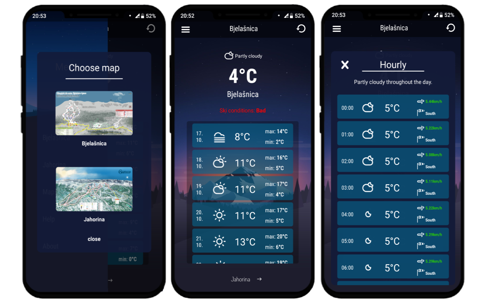

## Snow tracker (android/ios app) 

#### Description:

Snow tracker is a simple and easy to use android/ios app made with React Native. The app tracks the weather(daily and hourly) for two biggest ski resorts in Bosnia&Herzegovina. It calculates if the ski conditions are good, moderate or bad depending on the temperature, wind speed, precipitation, etc. Snow Tracker also provides official maps for the resorts. Data for the weather is provided by DarkSky API.

#### Video <a href="https://player.vimeo.com/video/370155585" target="_blank">here</a>:

